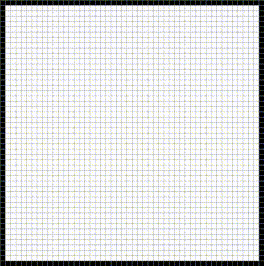

# ASTAR PathFinder
## created by Paweł Perenc

<!-- TABLE OF CONTENTS -->

  
Table of Contents

  <ol>
    <li>
      <a href="#about-the-project">About The Project</a>
      <ul>
        <li><a href="#built-with">Built With</a></li>
      </ul>
    </li>
    <li><a href="#license">License</a></li>
    <li><a href="#contact">Contact</a></li>
  </ol>

<!-- ABOUT THE PROJECT -->
## About The Project
A* (pronounced "A-star") is a graph traversal and path search algorithm, which is often used in many fields of computer science due to its completeness, optimality, and optimal efficiency. Presented with graphic visualization created with pygame. Algorithm is using mobility from chess and have 8 possible directions from all non border cells (as king in chess game). Diagonal movement is counted as sqrt(2), diagonal and horizontal as 1.
<!-- Image about -->

    

    

    

### Built With

* [pygame](https://www.pygame.org/news)
* [Python](https://www.python.org/)

<!-- LICENSE -->
## License

Distributed under the MIT License.

<!-- CONTACT -->
## Contact
[![LinkedIn][linkedin-shield]][linkedin-url]

<!-- MARKDOWN LINKS & IMAGES -->
<!-- https://www.markdownguide.org/basic-syntax/#reference-style-links -->
[linkedin-shield]: https://img.shields.io/badge/-LinkedIn-black.svg?style=for-the-badge&logo=linkedin&colorB=555
[linkedin-url]: https://www.linkedin.com/in/pawe%C5%82-perenc-51b39315a/
